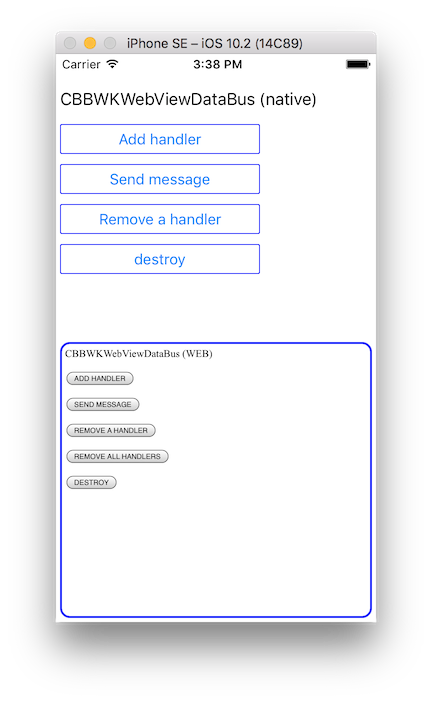

# <p align="center"></p>
次のインタフェース及び実装を提供します。

|class|description|
|---|---|
|`CBBDataBus`|iOSアプリ（Objective-c/swift）で利用できるDataBus基本クラス|
|`CBBWebViewDataBus`|ネイティブコード と WebView(JavaScript) 間で利用できるDataBus|
|`CBBMemoryQueue`|同一プロセス内での通信機構|
|`CBBMemoryQueueDataBus`|`CBBMemoryQueue` を用いたDataBus|
|`CBBMultiplexDataBus`|DataBusを多重化|

## Example
本リポジトリの [Example](Example), [Example-swift](Example-swift) ディレクトリが, WKWebView(HTML/JavaScript) と ネイティブコード間の DataBus `(CBBWKWebViewDataBus)` で通信をする簡単なサンプル・プロジェクトになっています。
- ネイティブコード(Objective-c): [ViewController.m](Example/Example/ViewController.m)
- ネイティブコード(Swift): [ViewController.swift](Example-swift/Example-swift/ViewController.swift)
- HTML: [index.html](Example/www/index.html), [script.js](Example/www/script.js)



Exampleをビルドして動作させる場合, 事前に `pod install` を実行してください。
```
cd Example
pod install
open Example.xcworkspace
```

または

```
cd Example-swift
pod install
open Example-swift.xcworkspace
```

## Setup
### Podfile
```
abstract_target 'defaults' do
    pod 'CBBDataBus', '~2.1.5'
end
```

## Usage
WebViewDataBusの基礎的な使用方法を示します。

#### step 1: WKWebView + DataBus を準備 (ネイティブコード)
- `WKWebView` で __Webコンテンツのloadを行う前__ に `CBBWebViewDataBus` インスタンスを作成する必要があります
- `CBBWebViewDataBus` は, Webコンテンツ側でDataBusを使用するためのJavaScriptコードをインジェクトします

```objective-c
    WKWebView webView = [[WKWebView alloc] init];
    CBBWKWebViewDataBus* dataBus = [[CBBWKWebViewDataBus alloc] initWithWKWebView:webView];
    [webView loadRequest:request];
```

> __注意点:__ 1つの `WKWebView` に対して作ることができる `CBBWKWebViewDataBus` のインスタンスは1つだけです。
> 複数のDataBusを利用したい場合は, `CBBMultiplexDataBus` を用いて多重化してください。

#### step 2: JavaScript側からsendされたデータをハンドリング (ネイティブコード)
```objective-c
    [dataBus addHandler:^(NSArray * _Nonnull data) {
        // 受信したdataを処理する
    } forName:@"data-bus-name"];
```

> 追加したハンドラは `CBBDataBus#removeHandler` または `CBBDataBus#removeAllHandlers` で削除できます。

#### step 3: JavaScript側へデータをsend (ネイティブコード)
`CBBDataBus#sendData` で `NSArray` 形式のデータを JavaScript側へ送信できます。
```objective-c
    [_dataBus sendData:@[@"This", @"is", @"test", @(1234)]];
```

#### step 4: DataBusを準備 (JavaScript)
次のコードでJavaScript側でDataBusのインスタンスを生成できます。

```javascript
var dataBus = new CBB.WebViewDataBus();
```

#### step 5: ネイティブコード側からsendされたデータをハンドリング (JavaScript)
`DataBus#addHandler` で function を追加することで, ネイティブコード側がsendしたデータをハンドリングできます。
```javascript
    dataBus.addHandler(function() {
        var data = arguments.join(',');
        console.log("received data from native: " + data);
    });
```

#### step 6: ネイティブコード側へデータをsend (JavaScript)
`DataBus#send` でデータをネイティブコード側へ送信できます。
```javascript
    dataBus.send(1, "arg2", {"arg3": 3});
```

#### step 7: 破棄
##### （JavaScript）
`DataBus#destroy` で破棄することができます。
```javascript
    dataBus.destroy();
```

##### （ネイティブコード）
`DataBus#destroy` で破棄することができます。
```objective-c
    dataBus.destroy();
```

## License
- Source code, Documents: [MIT](LICENSE)
- Image files: [CC BY 2.1 JP](https://creativecommons.org/licenses/by/2.1/jp/)
